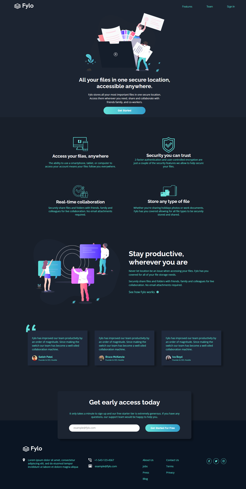

# Frontend Mentor - Fylo dark theme landing page solution

This is a solution to the [Fylo dark theme landing page challenge on Frontend Mentor](https://www.frontendmentor.io/challenges/fylo-dark-theme-landing-page-5ca5f2d21e82137ec91a50fd). Frontend Mentor challenges help you improve your coding skills by building realistic projects. 

## Table of contents

- [Overview](#overview)
  - [The challenge](#the-challenge)
  - [Links](#links)
  - [Screenshot](#screenshot)
- [My process](#my-process)
  - [Built with](#built-with)
  - [What I learned](#what-i-learned)
  - [Continued development](#continued-development)
- [Author](#author)

## Overview

### The challenge

Users should be able to:

- View the optimal layout for the site depending on their device's screen size
- See hover states for all interactive elements on the page

### Links
- Solution URL: [Add solution URL here]([https://your-solution-url.com](https://github.com/ankitwaware/Frontend-Mentor---Fylo-dark-theme-landing-page))
- Live Site URL: [Add live site URL here]([https://your-live-site-url.com](https://silver-madeleine-01f9a8.netlify.app/))

### Screenshot

#### Desktop - 1400px 

### Built with

- Semantic HTML5 markup
- CSS custom properties
- Flexbox
- CSS Grid
- Desktop-first workflow

### What I learned
- Advance css 
- css grid 
- From validation 
- smooth scrolling

### Continued development

- Styicky Navigaiton Bar for desktop
- Navigation slider for mobile

## Author

- Frontend Mentor - [@ankitwaware](https://www.frontendmentor.io/profile/@ankitwaware)
- Twitter - [@wawareankit](https://www.twitter.com/wawareankit)

